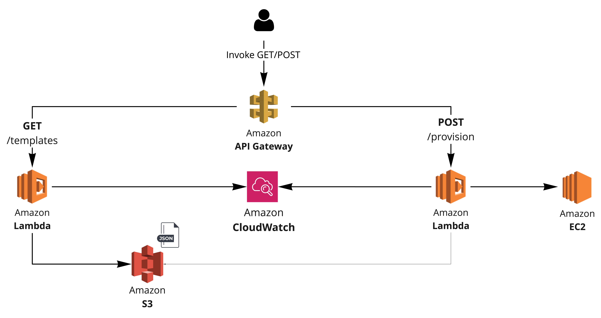

# AWS Lambda EC2 Provisioner Demo



## Requirements

### Tooling

* AWS CLI >= 2.1.31
* JQ >= 1.6
* Terraform >= v1.0.9

### AWS Credentials

```shell
aws configure --profile=onequicklab
```

Create a `terraform.tf` file with the following content:

```file
provider "aws" {
  region  = var.aws_region
  profile = "onequicklab"
}

terraform {
  required_providers {
    archive = "~> 1.3"
  }
}
```

## Provisioning

### Initialization

```shell
terraform workspace new onequicklab
terraform init -reconfigure -upgrade
```

Also, export the following variable required during provisioning:

```bash
export TF_VAR_provisioner_deployed_at=$(date +%s)
```

### Validation

```shell
terraform fmt
terraform validate
```

### Planning

```shell
terraform plan -var-file=examples/onequicklab/configs/input.tfvars
```

### Applying

```shell
terraform apply -var-file=examples/onequicklab/configs/input.tfvars
```

If you receive the following message when calling your API endpoint, export the `TF_VAR_provisioner_deployed_at` again and execute the apply process again:

```json
{
  "message": "Internal server error"
}
```

The stage variable `provisioner_deployed_at` will get updated and this will force an API Deployment.

### Testing

Once resources are provisioned, Terraform will output the AWS API Endpoint URL which can be used to trigger the Lambda functions:

```shell
Apply complete! Resources: 19 added, 0 changed, 0 destroyed.

Outputs:

api_url = "https://80b0x6xz60.execute-api.ca-central-1.amazonaws.com/onequicklab"
```

Two API methods are available. Each one calls a different Lambda function, as follow:

#### OneQuickLabProvisionerGetTemplates

* `Function Name: OneQuickLabProvisionerGetTemplates`
* `Method: GET`
* `API Path: /templates`

Triggering the `OneQuickLabProvisionerGetTemplates` Lambda function can be achieved as follow:

```bash
curl -s https://80b0x6xz60.execute-api.ca-central-1.amazonaws.com/onequicklab/templates | jq .
```

The function will return the available templates that can be used:

```json
{
  "response_code": 200,
  "headers: ": {
    "Content-Type": "application/json"
  },
  "body": {
    "provisioner": {
      "linux": {
        "ami": "ami-0a70476e631caa6d3",
        "instance_type": "t2.micro",
        "public_ip": true,
        "root_storage": 30,
        "key_name": "onequicklab-lambda-provisioner",
        "instance_count": 1,
        "region": "ca-central-1"
      },
      "windows": {
        "ami": "ami-04ce2d3d06e88b4cf",
        "instance_type": "t3.large",
        "public_ip": true,
        "root_storage": 60,
        "key_name": "onequicklab-lambda-provisioner",
        "instance_count": 1,
        "region": "ca-central-1"
      }
    }
  }
}
```

#### OneQuickLabProvisionerCreateEc2

* `Function Name: OneQuickLabProvisionerCreateEc2`
* `Method: POST`
* `API Path: /provision`

Triggering the `OneQuickLabProvisionerCreateEc2` Lambda function can be achieved as follow:

```bash
curl -sX POST https://80b0x6xz60.execute-api.ca-central-1.amazonaws.com/onequicklab/provision\?instanceTemplate\=linux | jq .
```
This function will return the `instanceId` of the newly created EC2 instance:

```json
{
  "instanceId": "i-006604b1175489864"
}
```

### Validating

Validate instances were properly provisioned and their statuses with the following command:

```shell
aws --profile=onequicklab ec2 describe-instances | jq '.Reservations[].Instances[] | .InstanceId, .State'
```

## Decommissioning

```shell
terraform destroy -var-file=examples/onequicklab/configs/input.tfvars
```